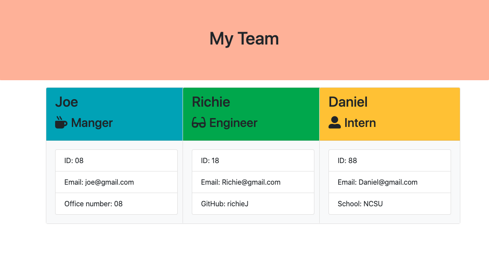
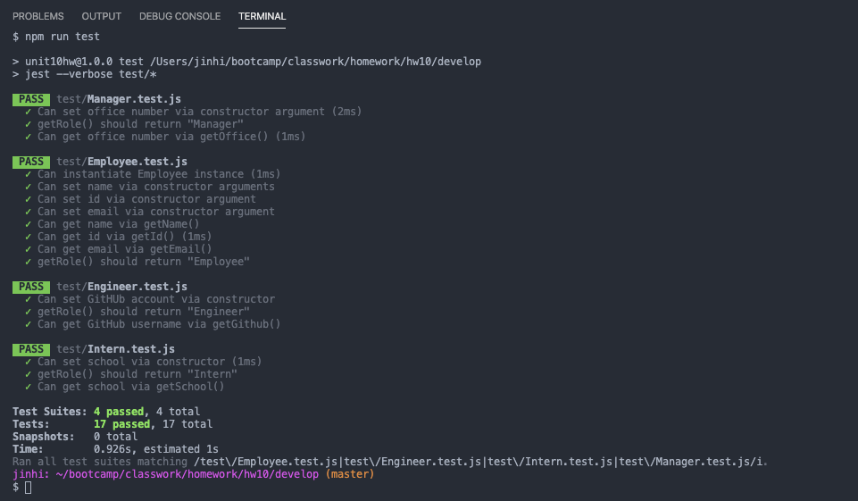

# TemplateEngineEmployeeSummary
hw10

## Project Info 

This project is designed to build a team generator command line application using Node CLI. 

 

## User Story

As a manager
I want to generate a webpage that displays my team's basic info
so that I have quick access to emails and GitHub profiles

## Usage 

To use this application, user should begin by running npm install (in the terminal) to install all dependencies.
After installation, user will be able to run node app.js and will be prompted with "Build your team!" and a series of questions to add the "Manager" will be prompted. Once user answers these questions, they will be prompted to choose between adding an "Engineer" or an "Intern" followed by a customized series of questions based on the role the user chooses. When the user is finished adding their team members, they will choose "Done" and the team.html will be dynamically generated to the output folder and display the user inputs for each team member. 

[Demo](EmployeeSummaryDemo.gif)

## Test

NPM run test was performed. 

## Technologies / Techniques Used

This application uses Bootstrap and Node.js

## Contribution
Jinhi Ahn 

## Resources
* StackOverflow
* W3Schools
* Bootstrap
* MDN